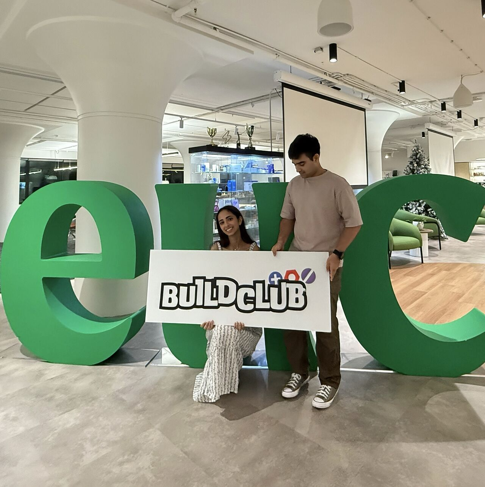
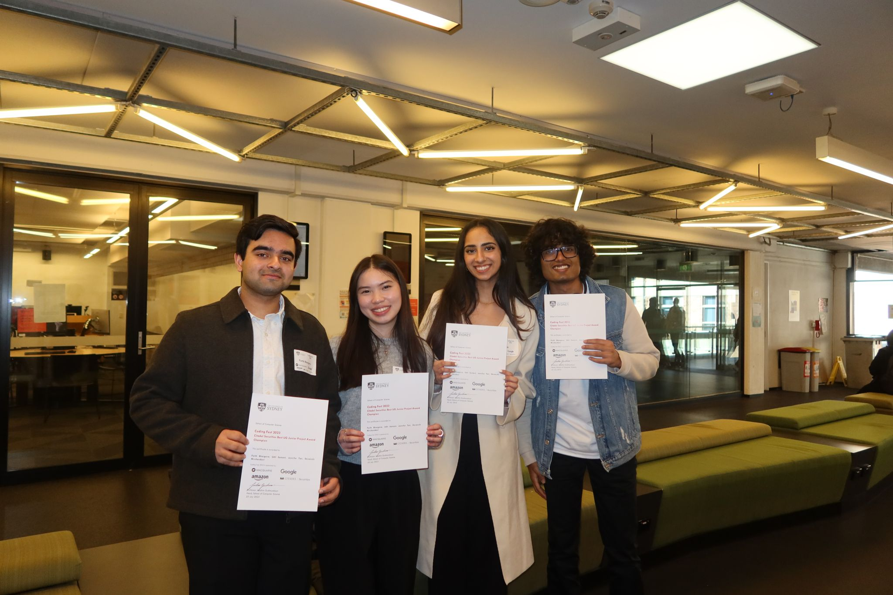

I thrive on building innovative solutions in high-pressure, collaborative environments — and hackathons are my favorite playground. Here’s a glimpse into some of the most rewarding projects I’ve been a part of.

---------------------------------------------------------------------------------------------------------------------

## **Build Club x Eucalyptus AI Hackathon, December 2024**
### 🚀 *Love, Blandy: Support When It’s Needed Most*

Inspired by Euc’s roadmap and a critical 16-hour gap in patient support, our team developed Love, Blandy, a Python-powered web app leveraging Bland.ai’s API. This solution bridges the communication gap between coaches and patients by initiating daily AI check-ins, collecting patient progress data, and displaying insights on a coach dashboard.

- **Award 🏆** Winner, Build Club x Eucalyptus AI Hackathon
- **Tech Stack 🛠️** Python web app, Bland.ai API

Our innovation reimagines patient-coach interaction, offering timely support and paving the way for future integration with video AI solutions for an even more personalized experience.

<figure style="display: flex; flex-direction: column; justify-content: center; align-items: center">
  
  <figcaption style="margin-top: 10px; text-align: center;">Winning the Build Club x Eucalyptus AI Hackathon</figcaption>
</figure>

---------------------------------------------------------------------------------------------------------------------

## **University of Sydney Coding Fest, July 2023**
### 🚀 *UniTrack: Navigating Success, One Course at a Time*

UniTrack is a user-friendly web app designed to revolutionize course planning for University of Sydney students. Built from scratch, it integrates course outlines, degree requirements, and personalized planning tools into a seamless platform, simplifying the academic journey.

- **Award 🏆** Citadel Securities Best Undergraduate Junior Project
- **Tech Stack 🛠️** JavaScript, Next.js, Material UI, Firebase, Vercel

Our team of four focused on intuitive UI/UX and functionality, earning recognition for its potential to enhance the student experience. UniTrack is more than a tool—it’s a step toward empowering students to make informed decisions about their studies.

<figure style="display: flex; flex-direction: column; justify-content: center; align-items: center">
  
  <figcaption style="margin-top: 10px; text-align: center;">Winning Top Undergraduate Junior Project</figcaption>
</figure>

---------------------------------------------------------------------------------------------------------------------
